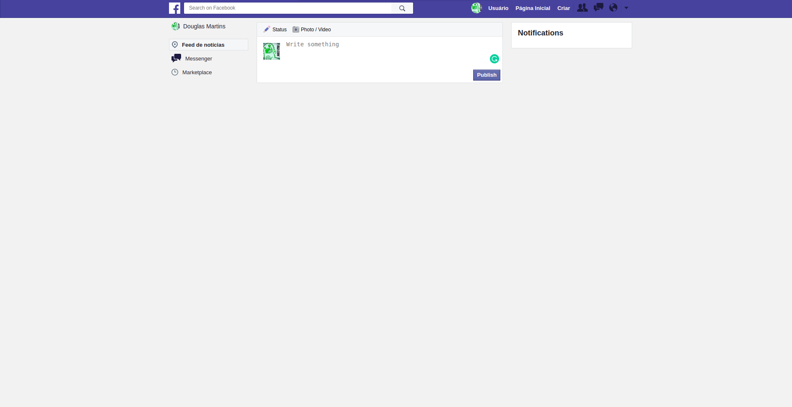

## Overview

Projeto para demostração da construção de layout semelhante ao Facebook, usando websocket para
curtidas e posts sendo mostrados para mais de um usuario

<h1 align="center">

</h1>

<h3 align="center">
Feito com adonis no back-end, banco de dados postgres
</h3>
